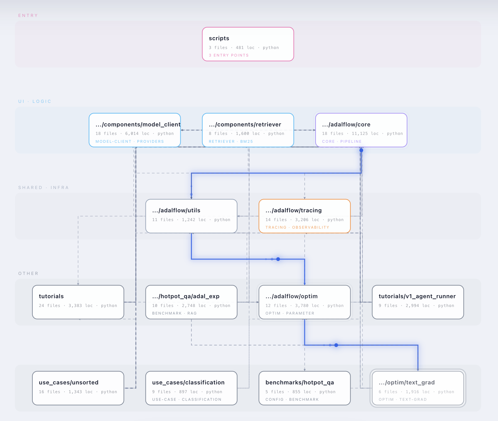
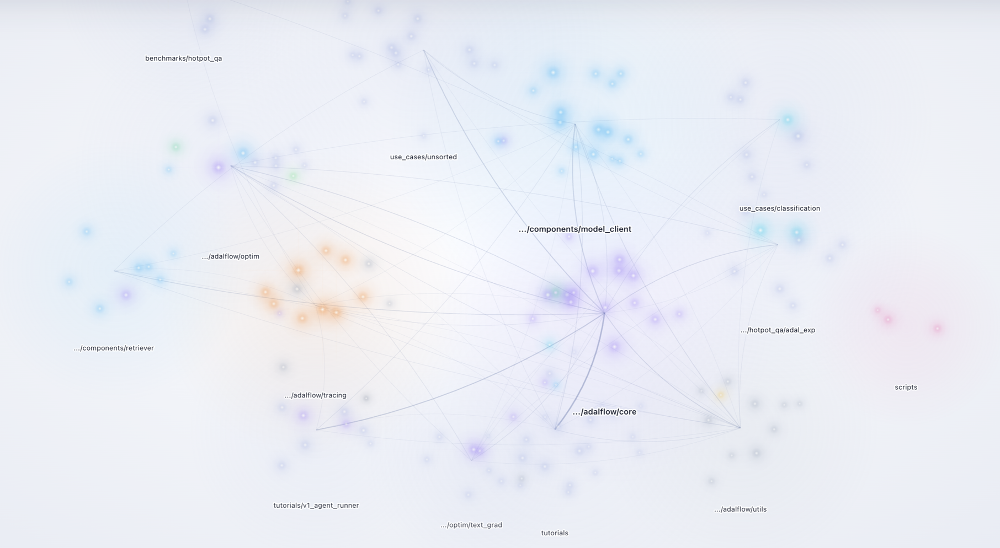

# codegraph

*[中文](./README.zh-CN.md)*

**Turn any codebase into an explorable interactive graph — one self-contained HTML file.**

A deterministic scan extracts files, imports, symbols, call edges, PageRank
importance, architectural layers, dependency cycles, and entry points. You add
the meaning — plain-English summaries and guided tours. The result is a single
offline HTML file with three linked views: an architecture **overview**, an
orbitable **star map**, and an expandable **explore** tree.

No build step, no CDN, no API key in the artifact. **Requires `python3` 3.8+**
(pure stdlib). ~2s for 230k LOC.



<sub>codegraph run against [AdalFlow](https://github.com/SylphAI-Inc/AdalFlow) —
466 files, 103,010 LOC. The overview view: module boxes on layer bands
(`ENTRY` → `UI · LOGIC` → `SHARED · INFRA` → `OTHER`), file/LOC counts per box,
and the primary dependency path traced in blue.
**[▶ Watch the 40s walkthrough on YouTube](https://youtu.be/0jmKh3dBnIA)**</sub>

> This README is the human-facing overview. The agent-facing instructions live
> in [`SKILL.md`](./SKILL.md) — read that before running anything.

---

## Install

codegraph ships in the `core-skills` plugin of the
[AdaL Skills Marketplace](../../README.md). Both AdaL CLI and Claude Code use
the same commands:

```
/plugin marketplace add SylphAI-Inc/skills
/plugin install core-skills@adal-agent-skills
```

Then just ask, in natural language:

> "Help me understand this codebase — map it out and tell me where to start reading."

The skill triggers on its own — you never invoke the scripts by hand in normal
use.

---

## The three views

What you get is a single HTML file carrying three linked views of the same
scan, cycled with `Tab`. Clicking a module box or a galaxy drills into explore,
focused on that module's files.

| View | Answers | What it is |
|---|---|---|
| **overview** | *"what are the parts?"* | Architecture diagram — module boxes on layer bands, flowing connectors, a comet on the primary dependency path. Derived from the scan, never authored, so it cannot drift from the real code. |
| **star map** | *"where is the weight of this system?"* | The same modules as an orbitable galaxy field, brightness = importance. Drag to orbit, scroll to dolly, shift-drag to pan, `0` to reset. A projected 2.5D disc in Canvas — no three.js, no WebGL. |
| **explore** | *"how do the pieces connect?"* | An expandable tree opened one level at a time: folders → files → symbols. A `+N` badge on every collapsed node says how much is inside, so nothing is hidden silently. |



<sub>The star map on the same AdalFlow scan — every module a galaxy, brightness
and cluster size tracking importance. `core` and `components/model_client` sit at
the centre of the dependency web; `optim` and `tracing` form their own arms.</sub>

### Every node says something, with zero model calls

`scan.py` reads the codebase's **own docstrings and file-header comments** —
module docstrings, JSDoc blocks, Go/Rust line comments — and uses them as node
summaries. Boilerplate is filtered and text is cut at `Args:`/`Returns:` so the
summary stays one sentence.

Measured on a real 109k-LOC repo: **87% of files described with zero model
calls.** The agent's `enrich.json` overrides these where it can say something
better, and the inspector labels which is which — an extracted summary is
marked *from the file's docstring*, so provenance is never ambiguous.

This matters because a graph of unlabelled dots teaches nothing.

### Keeping a dense repo readable

Real repos produce hairballs, so explore **starts simplified** and lets the
reader add detail back: tests hidden, hub-file edges folded to a `⋯n` badge,
`calls` edges off (they outnumber imports ~5:1), distance LOD, and a
neighbourhood focus mode.

Measured on a 109k-LOC repo: **628 → 172 edges (−73%)** at defaults, **−87%**
in focus mode.

**Why not 3D?** The clutter is edge *count*, not a missing dimension. 3D adds
occlusion, rotation disorientation, and a ~600KB three.js dependency that breaks
the single-file offline contract. LOD plus folding solves the actual problem.

---

## Examples in the wild

| Demo | Repo scanned | What it exercises |
|---|---|---|
| [▶ 40s walkthrough on YouTube](https://youtu.be/0jmKh3dBnIA) | [AdalFlow](https://github.com/SylphAI-Inc/AdalFlow) — the LLM task-pipeline framework | 466 files, 103,010 LOC, Python. All three views, 3 guided tours, layer bands, the inspector with metrics + `DEFINES` + `DEPENDS ON`, live theme toggle |

AdalFlow is a useful reference scan because it is a genuinely layered Python
codebase — `core/` primitives under `components/` clients and retrievers, with
`optim/`, `tracing/`, benchmarks, and tutorials on top. The walkthrough opens on
the overview, orbits the star map, then drills into `core/component.py` with a
tour running, which is the shape most onboarding sessions take.

---

## Why it exists

Onboarding onto an unfamiliar repo is mostly archaeology: grep, follow an
import, lose the thread, start over. The usual tooling does not help much —
`tree` shows folders but not flow, an IDE call graph shows edges but not
importance, and an auto-generated dependency diagram of a real repo is a
hairball nobody reads twice.

codegraph splits the problem the way it should be split:

- **A script owns structure** — files, imports, calls, metrics, cycles, layers.
  Deterministic and reproducible: the same commit always yields the same edges.
- **A model owns meaning** — what a file is *for*, and in what order to read
  things. Only a model can write that.

**The goal is not a graph that shows off how complex the code is — it is a graph
that quietly teaches someone how the pieces fit together.** Which is why the
highest-value output is not the diagram at all; it is the guided tour, because
reading *order* is the thing a newcomer actually lacks.

---

## When to use it

Reach for codegraph when someone needs to **understand a repo**, not a file:

- "help me understand this codebase" / "I just joined this project"
- "map / visualize / diagram this repo or its architecture"
- "what are the entry points?" / "where do I start reading?"
- "how does data flow through this?" / "generate an onboarding guide"
- "show me the dependency graph" / "find circular dependencies"
- "which files are most important here?"

**Do not** use it to explain a single file — just read the file.

---

## How it works

Three stages. Two are deterministic; only the middle one uses a model. The
split is the design — structure never depends on a model's guess, and meaning
never pretends to be reproducible.

```
1. scan.py    codebase  ──▶  graph.json + digest.md    deterministic, no LLM, no network
2. the agent  digest.md ──▶  enrich.json               summaries, layer fixes, tours
3. render.py  both      ──▶  codegraph.html            one portable self-contained file
              (overview.py collapses the graph into the overview diagram en route)
```

| Stage | Owner | Guarantee |
|---|---|---|
| Structure (files, imports, calls, metrics, cycles) | `scan.py` | Reproducible — same commit, same edges |
| Meaning (what a file is *for*, tours) | the agent | Only a model can write this |
| Delivery (layout, validation, HTML) | `render.py` | Validated before write; a broken artifact never replaces a good one |

`graph.json` is machine output and is never hand-written; the agent only ever
writes `enrich.json`. Because the two are separate files, **existing summaries
survive a re-scan** — only ids that no longer exist get dropped.

---

## Interaction reference

| Key | Does |
|---|---|
| `Tab` | Flip between overview and explore |
| `/` | Search by name, path, summary text, or tag |
| `P` · `[` · `]` | Play / step guided tours |
| `F` | `simplify` — fold hub-file edges (~−48% clutter) |
| `N` | `focus` — selection plus top neighbours only (~−87%) |
| `H` | Back to the flat all-at-once graph |
| `space` | Pause motion (also for screenshots) |
| `T` · `0` | Theme toggle · fit / reset view |

Every node also carries an **`ask ▸`** button that copies a complete prompt —
path, summary, LOC, fan-in/fan-out, symbols defined, and both edge directions —
ready to paste into any LLM. Deliberately **not** done: embedding an API key in
the HTML. The file gets committed and shared, so a key in it is a leak waiting
to happen.

---

## Languages

Python, JS/TS (+JSX/TSX), Vue, Svelte, Go, Rust, Java, Kotlin, Scala, Ruby, PHP,
C#, C/C++, Objective-C, Swift, shell, SQL, Terraform, GraphQL, Protobuf — plus
config/docs/Docker as context nodes.

Import resolution is real: relative paths, package roots, `@/` aliases, Go
modules, Rust `crate::`/`mod`, JVM packages.

---

## Honest limits

Extraction is regex-based, not a full type-checking AST — excellent for imports
and definitions, approximate for calls.

- **`calls` edges are a hint, not fact.** Unique unambiguous names only; common
  names like `get`/`run` are deliberately skipped. Imports are trustworthy.
- **Dynamic imports, DI containers, reflection, and runtime registration are
  invisible** to static scanning.
- **Layers are path heuristics** until the agent overrides them in `enrich.json`.
- Generated code, minified bundles, and lockfiles are excluded on purpose.

---

## Output contract

One self-contained `.html` at `<repo>/.codegraph/codegraph.html`:

- Inline CSS/JS and inline SVG, **no CDN, no external assets, no API key**
- Works offline, opened straight from the filesystem — safe to commit or email
- Motion pauses on `space` and is off automatically under `prefers-reduced-motion`
- Performance decoupled from graph size: static scene on a base canvas, motion on
  an overlay, packets capped. Measured **60fps on a 2,660-node graph**

Commit `.codegraph/` to let teammates open the graph with zero setup.

---

## Repository layout

```text
codegraph/
├── SKILL.md                       # agent instructions (the entry point)
├── README.md                      # this file
├── assets/                        # sample output shown in this README
│   ├── codegraph-adalflow-overview.png
│   └── codegraph-adalflow-starmap.png
└── scripts/
    ├── scan.py                    # stage 1 — deterministic structural scan
    ├── overview.py                # collapses the graph into the overview diagram
    ├── render.py                  # stage 3 — validate + emit the HTML artifact
    ├── viewer.html                # the artifact template
    └── test_codegraph.py          # test suite
```

---

## License

MIT, as part of the [AdaL Skills Marketplace](../../README.md).
